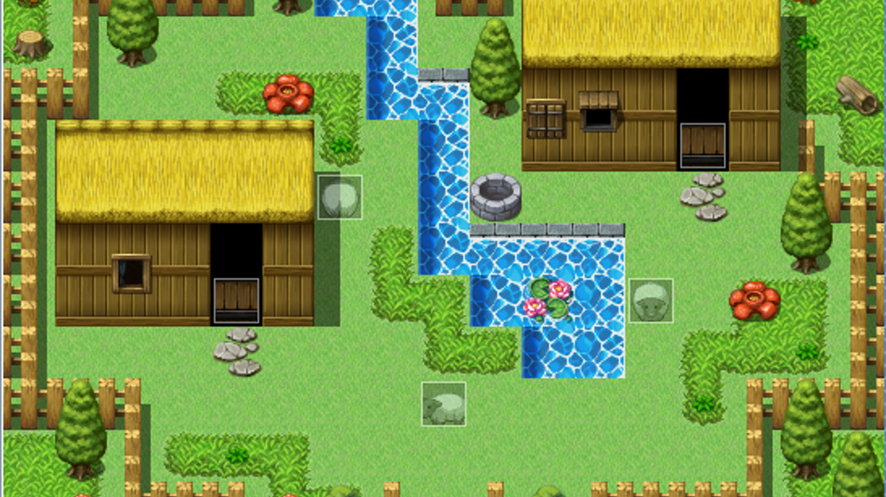

# my_rpg_2017
First year project in C, in which the goal was to built a old school 90's style RPG game using CSFML. There is a nice storyline with bosses and several quests. The game include as well menu/pause menu, particles system, camera movement, animations, sounds, NPC characters, inventory with items, experience/level up points system, maps, collision system/physics (walls, fences etc..) and character movement.

PREREQUISITE :

    CSFML must be installed.

USING : 
    
    Make
    
    ./my_rpg.

